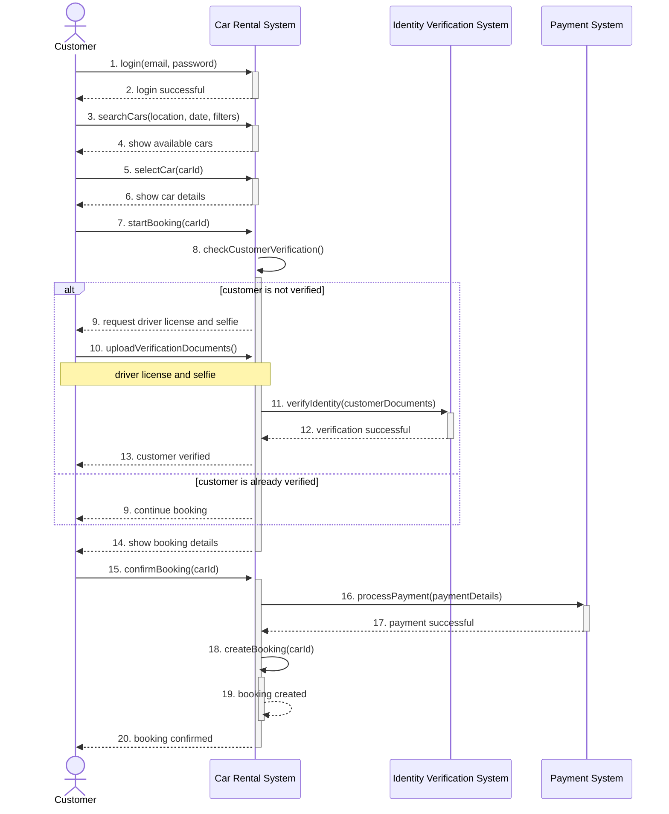
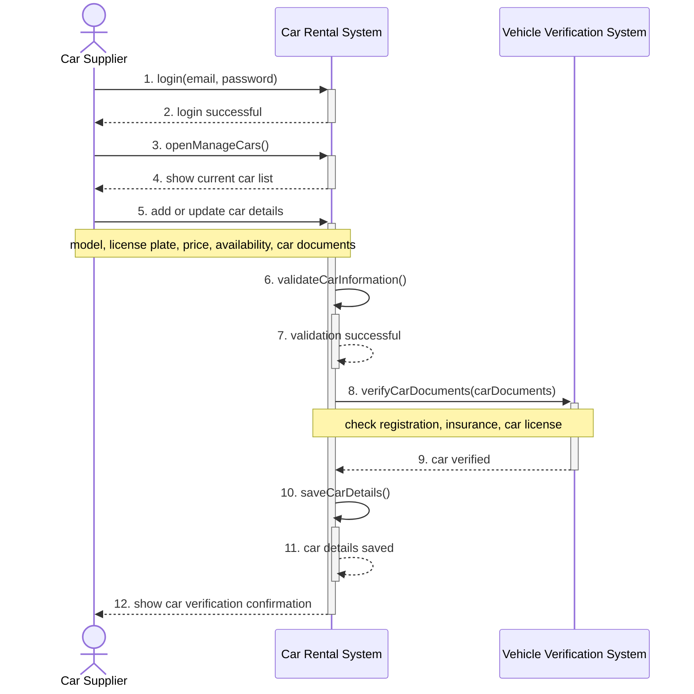

# Car Rental System Sequence Diagrams

```mermaid
sequenceDiagram
    actor Customer
    participant CRS as Car Rental System
    participant IVS as Identity Verification System
    participant PS as Payment System

    Customer->>+CRS: 1. login(email, password)
    CRS-->>-Customer: 2. login successful

    Customer->>+CRS: 3. searchCars(location, date, filters)
    CRS-->>-Customer: 4. show available cars

    Customer->>+CRS: 5. selectCar(carId)
    CRS-->>-Customer: 6. show car details

    Customer->>+CRS: 7. startBooking(carId)
    CRS->>+CRS: 8. checkCustomerVerification()
    alt customer is not verified
        CRS-->>Customer: 9. request driver license and selfie
        Customer->>CRS: 10. uploadVerificationDocuments()
        Note over Customer,CRS: driver license and selfie
        CRS->>+IVS: 11. verifyIdentity(customerDocuments)
        IVS-->>-CRS: 12. verification successful
        CRS-->>Customer: 13. customer verified
    else customer is already verified
        CRS-->>Customer: 9. continue booking
    end
    CRS-->>-Customer: 14. show booking details

    Customer->>+CRS: 15. confirmBooking(carId)
    CRS->>+PS: 16. processPayment(paymentDetails)
    PS-->>-CRS: 17. payment successful

    CRS->>+CRS: 18. createBooking(carId)
    CRS-->>-CRS: 19. booking created
    CRS-->>-Customer: 20. booking confirmed
```

## 2. Sequence Diagram: Manage Cars

```mermaid
sequenceDiagram
    actor Supplier as Car Supplier
    participant CRS as Car Rental System
    participant VVS as Vehicle Verification System

    Supplier->>+CRS: 1. login(email, password)
    CRS-->>-Supplier: 2. login successful

    Supplier->>+CRS: 3. openManageCars()
    CRS-->>-Supplier: 4. show current car list

    Supplier->>+CRS: 5. add or update car details
    Note over Supplier,CRS: model, license plate, price, availability, car documents

    CRS->>+CRS: 6. validateCarInformation()
    CRS-->>-CRS: 7. validation successful

    CRS->>+VVS: 8. verifyCarDocuments(carDocuments)
    Note over CRS,VVS: check registration, insurance, car license
    VVS-->>-CRS: 9. car verified

    CRS->>+CRS: 10. saveCarDetails()
    CRS-->>-CRS: 11. car details saved
    CRS-->>-Supplier: 12. show car verification confirmation
```